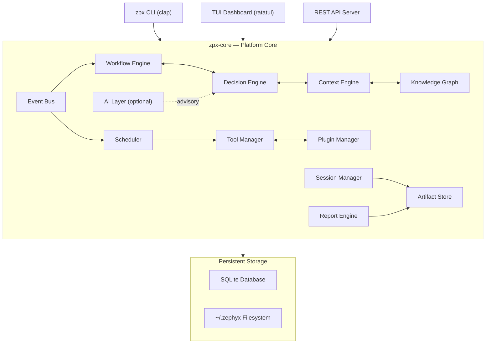
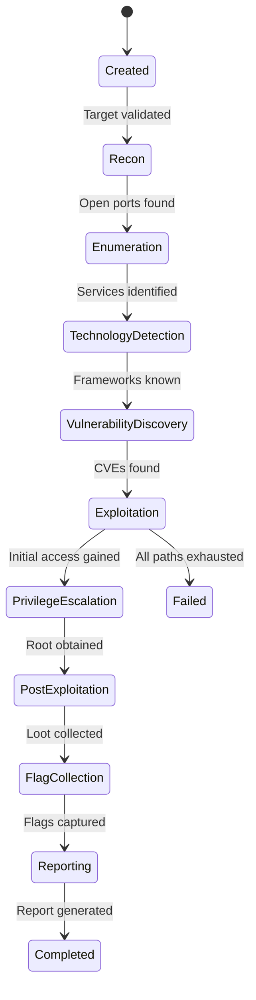
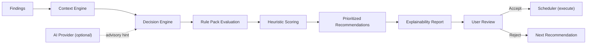
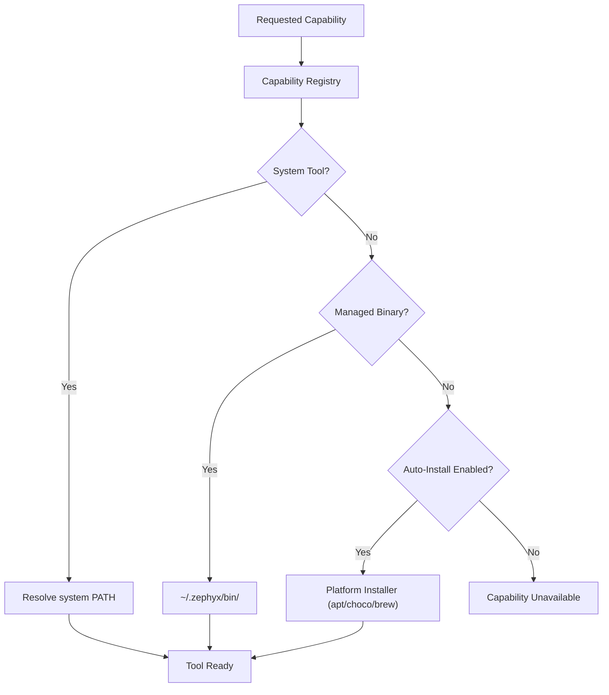
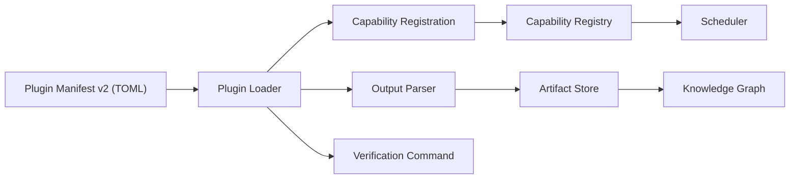
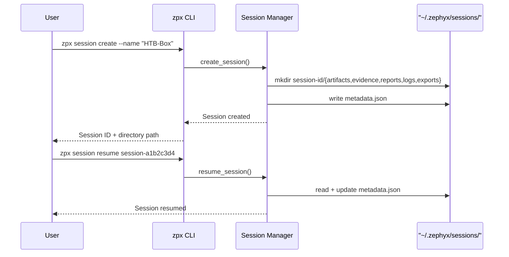

<div align="center">

<br/>

# ⚡ Zephyx

### *Extensible Cybersecurity Operating Platform*

**Workflow-driven. Intelligence-augmented. Deterministically safe.**

[](https://www.rust-lang.org/)
[](LICENSE)
[](SUPPORTED_PLATFORMS.md)
[](CHANGELOG.md)
[](docs/getting-started.md)
[](docs/)
[](CONTRIBUTING.md)

<br/>

> **⚠️ Authorized Use Only** — Zephyx is designed exclusively for authorized penetration testing, CTF competitions, and educational security research. Users are responsible for complying with all applicable laws.

<br/>

[Get Started](#-quick-start) · [Features](#-features) · [Architecture](#-architecture) · [CLI Reference](#-cli-reference) · [Documentation](docs/) · [Contributing](CONTRIBUTING.md)

</div>

---

## 🧠 What is Zephyx?

Zephyx is an **open-source, workflow-driven cybersecurity operating platform** built entirely in Rust. It provides a unified environment for orchestrating security tools, managing assessment sessions, tracking findings, and generating professional reports — all from a single command-line interface.

Unlike ad-hoc terminal workflows where you juggle tools, track notes in text files, and manually correlate output, Zephyx gives you a **structured, intelligent platform** that understands the phases of a penetration test or CTF engagement from start to finish.

### Why Zephyx Exists

Every security practitioner has experienced the chaos of a complex engagement:

- Running the same nmap scan three times because you forgot where you saved the output
- Manually copy-pasting findings between tools with no audit trail
- Losing track of which phase you're in or what to try next
- Writing the final report from scratch using scattered notes

Zephyx solves these problems by bringing **structure, automation, and intelligence** to the security workflow — without removing the human from the loop.

### What Problems Does It Solve?

| Problem | Zephyx Solution |
|---|---|
| Disorganized tool output | Centralized artifact store with structured findings |
| No workflow guidance | Phase-aware state machine with built-in methodology |
| Manual tool chaining | Automation pipeline engine |
| Forgetting what you tried | Session replay and journal system |
| Writing reports manually | One-command report generation (MD, HTML, JSON, CSV) |
| Tool availability varies | Capability registry with fallback resolution |
| No memory across sessions | Long-term knowledge memory system |

### Who Is Zephyx For?

| Audience | Use Case |
|---|---|
| 🏁 **CTF Players** | Structured workflow for HTB, THM, PicoCTF, NahamCon |
| 🎓 **Students** | Learn methodology while practicing on legal labs |
| 🔬 **Security Researchers** | Reproducible, auditable assessment pipelines |
| 🔴 **Red Teamers** | Multi-session campaign tracking and tool orchestration |
| 🛡️ **Ethical Hackers** | Professional reporting and evidence management |
| 🧑‍💻 **Security Enthusiasts** | Explore security tooling in a structured environment |

---

## ✨ Features

### 🔄 Workflow Engine
A phase-aware state machine that guides your assessment through 9 defined phases: **Recon → Enumeration → Technology Detection → Vulnerability Discovery → Exploitation → Privilege Escalation → Post-Exploitation → Flag Collection → Reporting**. Automatically transitions phases based on discovered findings.

### 🧠 Decision Engine
Deterministic rule-based decision engine that analyzes findings and generates prioritized, reasoned recommendations. No black-box AI required — every recommendation includes its rule, confidence score, and evidence chain.

### 🛠️ Tool Manager
Centralized tool catalog that tracks installation status, verifies binary availability, handles managed vs. system tool resolution, and supports automated installation. Supports tools like `nmap`, `ffuf`, `gobuster`, `linpeas`, `enum4linux`, and 40+ more.

### 🔌 Plugin System
Manifest v2 plugin architecture allowing external tools to integrate as first-class citizens. Plugins declare capabilities, supported platforms, verification commands, and output parsers. Compatible with the built-in marketplace.

### 🗺️ Knowledge Graph
Live, per-session attack graph that maps hosts, services, credentials, vulnerabilities, and flags into a queryable node-edge structure. Exportable as Mermaid diagrams for visual documentation.

### 🎯 Context Engine
Aggregated target intelligence layer that synthesizes all findings, ports, services, credentials, and phase history into a unified context snapshot — used by the decision engine and planner.

### ⏱️ Scheduler
Async task scheduler with configurable concurrency, priority queuing, CPU/memory throttling, and per-task lifecycle management (pause, resume, cancel, retry).

### 📁 Session Manager
Create, persist, list, and resume named assessment sessions. Each session has an isolated directory tree for artifacts, evidence, reports, logs, and exports stored under `~/.zephyx/sessions/`.

### 🗄️ Artifact Store
Structured storage for all tool outputs keyed to findings. Tracks MIME types, SHA-256 checksums, and provenance (which tool generated which artifact).

### 📡 Capability Registry
Abstracts tool capabilities from tool names — ask for "web directory bruteforce" and get the best available tool (`ffuf`, `gobuster`, or `feroxbuster`) based on what's installed.

### 📊 Reporting Engine
Generate professional reports in **Markdown, HTML, JSON, and CSV** format from a single command. Reports include the findings table, attack timeline, recommendations, and evidence chain.

### 🌐 REST API
Built-in internal HTTP API server for integration with external tools, dashboards, or CI pipelines.

### 🖥️ TUI Dashboard
Interactive terminal dashboard built with Ratatui — real-time task monitoring, finding browser, phase progress, and resource graphs.

### 💻 CLI
Comprehensive `zpx` command-line interface with 30+ top-level commands covering every platform capability.

### 🌍 Cross-Platform Support
Runs on Linux, Windows, and macOS. Platform adapter layer handles OS-specific tool management (APT, Chocolatey, Homebrew).

### 🤖 Offline AI Support
Optional AI provider integration (local LLMs via Ollama). Zephyx operates fully offline without any AI — AI is advisory-only and never executes commands autonomously.

### 🧰 Plugin SDK
Rust plugin SDK for building custom tool integrations. Full manifest, capability, and output parser scaffolding provided.

### 🏪 Marketplace Foundation
Plugin marketplace registry for discovering, searching, rating, and publishing community plugins.

---

## 🏗️ Architecture

### Platform Overview



### Workflow Pipeline



### Decision Engine Flow



### Tool Resolution



### Plugin Architecture



### Session Lifecycle



---

## 📦 Installation

### Prerequisites

- **Rust** 1.75+ (for building from source)
- **Cargo** (included with Rust)

### Building from Source (Recommended)

```bash
# Install Rust
curl --proto '=https' --tlsv1.2 -sSf https://sh.rustup.rs | sh
source $HOME/.cargo/env

# Clone the repository
git clone https://github.com/zephyx/zephyx.git
cd zephyx

# Build release binary
cargo build --release --bin zpx

# Install to system PATH
cargo install --path zpx-cli

# Verify
zpx --version
```

### Linux (Debian / Ubuntu / Kali / Parrot)

```bash
sudo apt update && sudo apt install -y build-essential curl
curl --proto '=https' --tlsv1.2 -sSf https://sh.rustup.rs | sh
git clone https://github.com/zephyx/zephyx.git
cd zephyx && cargo build --release
sudo cp target/release/zpx /usr/local/bin/
```

### Windows

```powershell
# Install Rust from https://rustup.rs, then:
git clone https://github.com/zephyx/zephyx.git
cd zephyx
cargo build --release --bin zpx
# Binary at: .\target\release\zpx.exe
```

### macOS

```bash
curl --proto '=https' --tlsv1.2 -sSf https://sh.rustup.rs | sh
git clone https://github.com/zephyx/zephyx.git
cd zephyx && cargo build --release
sudo cp target/release/zpx /usr/local/bin/
```

### Portable Binary

Pre-built binaries are available on [GitHub Releases](https://github.com/zephyx/zephyx/releases).

### Future Package Manager Support

```bash
# Planned (not yet available)
cargo install zpx
brew install zephyx/tap/zpx
```

---

## 🚀 Quick Start

```bash
# Check system health
zpx doctor

# Initialize workspace
zpx init --name "HTB-Lame" --ip 10.10.10.3

# Create a session
zpx session create --name "Lame-Assessment" --target 10.10.10.3

# Scan the target
zpx scan --ip 10.10.10.3

# Check workflow state
zpx workflow status

# Inspect decision engine
zpx decision inspect

# List available tools
zpx tool list

# Generate a report
zpx report --output writeup.md --format markdown

# Explain a finding
zpx explain finding

# Update Zephyx
zpx update
```

---

## 📚 CLI Reference

### Global

| Command | Description |
|---|---|
| `zpx --help` | Show all commands |
| `zpx --version` | Show version |
| `zpx doctor` | System diagnostics |
| `zpx update` | Update tool catalog |
| `zpx config` | View/edit configuration |

### `zpx init`
```bash
zpx init --name "TargetBox" --ip 10.10.10.123
```

### `zpx scan`
```bash
zpx scan --ip 10.10.10.123
```

### `zpx session`
```bash
zpx session create --name "HTB-Lame" --target 10.10.10.3
zpx session list
zpx session resume session-a1b2c3d4
```

### `zpx workflow`
```bash
zpx workflow list
zpx workflow start htb-linux
zpx workflow status
zpx workflow pause | resume | reset
```

### `zpx tool`
```bash
zpx tool list
zpx tool verify nmap
zpx tool install ffuf
zpx tool update gobuster
```

### `zpx plugin`
```bash
zpx plugin list
zpx plugin search "web fuzzing"
zpx plugin info nmap
zpx plugin install custom-scanner
zpx plugin doctor
```

### `zpx pack`
```bash
zpx pack list
zpx pack install recon      # nmap, rustscan, httpx, whatweb
zpx pack install web        # gobuster, ffuf, nikto, sqlmap
zpx pack install ad         # netexec, bloodhound, kerbrute
zpx pack install privesc    # linpeas, winpeas, pspy
```

### `zpx report`
```bash
zpx report --output writeup.md --format markdown
zpx report --output findings.json --format json
zpx report --output report.html --format html
```

### `zpx artifact`
```bash
zpx artifact list
zpx artifact export art-a1b2c3d4 ./output/
```

### `zpx rules`
```bash
zpx rules list
zpx rules enable ctf-recon
zpx rules info ctf-recon
```

### `zpx graph`
```bash
zpx graph show
```

### `zpx context`
```bash
zpx context show
```

### `zpx plan`
```bash
zpx plan --ip 10.10.10.123
```

### `zpx explain`
```bash
zpx explain finding
```

### `zpx api`
```bash
zpx api --port 8080
```

### `zpx snapshot`
```bash
zpx snapshot create
zpx snapshot list
zpx snapshot restore snap-id
```

### `zpx tasks`
```bash
zpx tasks list
zpx tasks pause task-1
zpx tasks cancel task-1
zpx tasks logs task-1
```

### `zpx pipeline`
```bash
zpx pipeline create my-pipeline
zpx pipeline run my-pipeline
zpx pipeline list
```

### `zpx decision`
```bash
zpx decision inspect
```

---

## ⚙️ Configuration

Config file: `~/.zephyx/config/config.toml`

```toml
[general]
auto_install_missing_tools = true
default_execution_profile = "default"
event_bus_capacity = 1024

[ai]
enabled = false
provider = "none"       # "ollama", "none"
advisory_only = true    # AI never executes commands

[scheduler]
max_concurrency = 4
default_timeout_secs = 300
```

### Built-in Profiles

| Profile | Threads | Timeout | Use Case |
|---|---|---|---|
| `default` | 4 | 300s | General use |
| `stealth` | 1 | 600s | Low noise |
| `aggressive` | 16 | 120s | Speed |
| `ctf` | 8 | 240s | CTF competitions |
| `lab` | 4 | 180s | Local labs |

---

## 🗂️ Workspace Structure

```
~/.zephyx/
├── bin/           # Managed tool binaries
├── plugins/       # Installed plugins
├── sessions/      # Assessment sessions
│   └── session-{id}/
│       ├── artifacts/
│       ├── evidence/
│       ├── reports/
│       ├── logs/
│       └── exports/
├── knowledge/     # Knowledge pack data
├── rules/         # Rule pack definitions
├── database/      # SQLite master DB
├── logs/          # Platform logs
├── cache/         # Temporary cache
├── models/        # Local AI models
├── templates/     # Workflow templates
└── reports/       # Global report archive
```

---

## 🔌 Plugin Development

See [docs/plugin-development.md](docs/plugin-development.md) for the full guide.

```toml
# manifest.toml
[plugin]
id = "my-scanner"
name = "my-scanner"
version = "1.0.0"
minimum_version = "0.6.0"
category = "Reconnaissance"
capabilities = ["port_scanning"]
verification_command = "my-scanner --version"
```

---

## 🧠 Intelligence Layer

Zephyx's intelligence layer is **100% deterministic by default** — no AI, no internet, no external APIs required.

1. **Rule Packs** — Pattern-matching rules that generate recommendations
2. **Heuristic Engine** — Confidence scoring from port/service patterns
3. **Decision Engine** — Evaluates rules against findings, ranks by priority
4. **Explainability** — Every recommendation includes full reasoning chain
5. **Memory System** — Learns effective tool flags from past sessions
6. **Planner** — Builds sequenced action plan from target context

AI integration is **optional and advisory-only**. Zephyx never autonomously executes commands.

---

## 🗺️ Roadmap

| Version | Status | Milestone |
|---|---|---|
| v0.1 | ✅ | Foundation — workspace, session, CLI |
| v0.2 | ✅ | Workflow Automation — state machine |
| v0.3 | ✅ | Platform Core — findings, artifacts, DB |
| v0.4 | ✅ | Infrastructure — scheduler, event bus |
| v0.5 | ✅ | Extensibility — plugin system, SDK |
| v0.6 | ✅ | Intelligence — decision engine, knowledge graph |
| v0.7 | 🚧 | Distributed Platform — team sessions |
| v0.8 | 🔮 | Cloud sync, web dashboard |

---

## 🤝 Contributing

See [CONTRIBUTING.md](CONTRIBUTING.md) for:
- Rust coding standards
- Workspace layout conventions
- Commit message format
- Pull request process

---

## 📄 License

Dual-licensed under **MIT** or **Apache 2.0** — your choice.

---

## ⚠️ Disclaimer

Zephyx is intended **exclusively** for:
- ✅ Authorized penetration testing
- ✅ CTF competitions
- ✅ Security training laboratories
- ✅ Academic research

**Unauthorized use against systems you do not own or have explicit permission to test is illegal. The authors assume no liability for misuse.**

---

## 🙏 Acknowledgements

- The **Rust community** for an exceptional ecosystem
- Maintainers of **nmap, ffuf, gobuster, linpeas, enum4linux** and all orchestrated tools
- **ratatui** and **clap** teams for excellent libraries
- **HackTheBox** and **TryHackMe** for ethical hacking environments
- All **community contributors** and early adopters

---

<div align="center">

Built with ❤️ and 🦀 Rust by the Zephyx Core Team

[⬆ Back to Top](#-zephyx)

</div>
