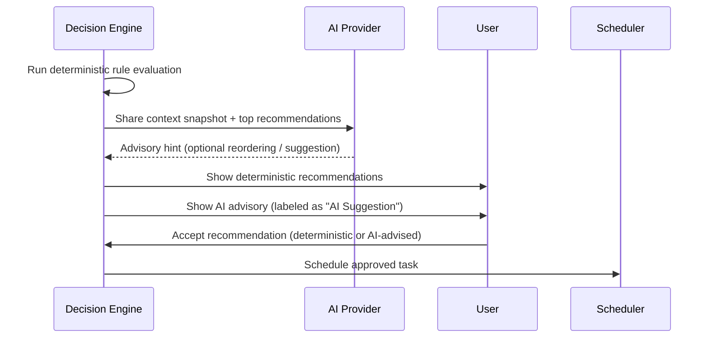

# AI Providers

Zephyx includes an optional AI layer that provides advisory intelligence. This document explains how it works, which providers are supported, and how to configure them.

---

## Design Philosophy

> AI in Zephyx is advisory-only. It can suggest. It cannot act.

The AI layer is built around a strict separation:

1. **Decision Engine** (deterministic) — always runs, always available offline
2. **AI Provider** (optional, advisory) — supplements with hints, never replaces the deterministic engine
3. **User** — always in control, must explicitly approve any action
4. **Scheduler** — only accepts tasks approved by the user

No AI path in Zephyx leads to autonomous command execution.

---

## `AiProvider` Trait

All AI providers implement the same interface:

```rust
pub trait AiProvider {
    fn provider_name(&self) -> &str;
    fn is_available(&self) -> bool;
    fn suggest(&self, context: &str) -> Option<String>;
}
```

This makes providers swappable without changing any other code.

---

## Supported Providers

### `None` (Default)

Zephyx operates with zero AI. The Decision Engine works entirely from rules and heuristics.

```toml
[ai]
enabled = false
provider = "none"
```

### Ollama (Local LLM)

Use a locally running Ollama instance with any supported model (llama3, mistral, codellama, etc.).

**Requirements:**
- [Ollama](https://ollama.com/) installed and running locally
- A model pulled (e.g., `ollama pull llama3`)

```toml
[ai]
enabled = true
provider = "ollama"
model = "llama3"
ollama_url = "http://localhost:11434"
advisory_only = true
```

### OpenAI-Compatible APIs

For any OpenAI-compatible API (OpenAI, Together AI, Groq, LM Studio, etc.):

```toml
[ai]
enabled = true
provider = "openai_compatible"
model = "gpt-4o-mini"
api_base_url = "https://api.openai.com/v1"
# API key from environment variable
```

```bash
export OPENAI_API_KEY="sk-..."
```

### Mock Provider (Testing)

Used internally for testing the AI pathway without an actual provider:

```toml
[ai]
enabled = true
provider = "mock"
```

---

## How AI Integration Works



---

## Checking AI Status

```bash
zpx ai doctor
```

**Output:**
```
Zephyx AI Layer Diagnostics:
  Active Provider: mock (Available: true)
  Guardrails:      Active (AI executes NO commands, advisory mode only)
```

---

## Managing Local Models

```bash
zpx model list
```

**Output:**
```
Zephyx Model Manager:
  - llama3:8b                      [ollama] Size: 4.7GB | Status: ready
  - mistral:7b                     [ollama] Size: 4.1GB | Status: ready
  - codellama:13b                  [ollama] Size: 7.4GB | Status: not_downloaded
```

---

## Privacy

When AI is enabled:
- Context sent to **Ollama** stays on your machine (fully local)
- Context sent to **OpenAI** is subject to OpenAI's data policies
- **No data is ever sent anywhere** when using the `none` or `mock` provider

The context sent to AI never includes raw system credentials or flag values — only finding metadata (port numbers, service names, phase information).
