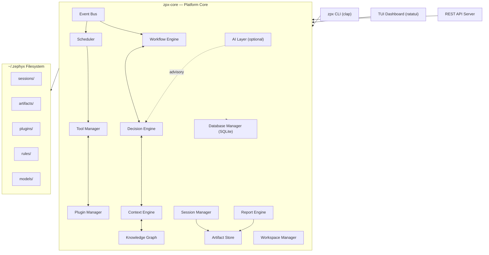
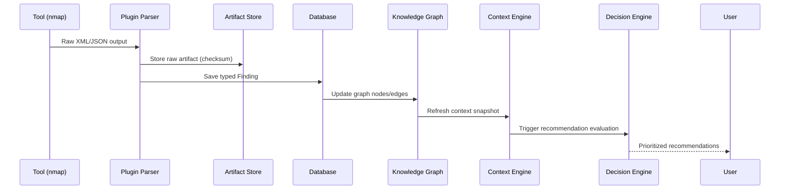
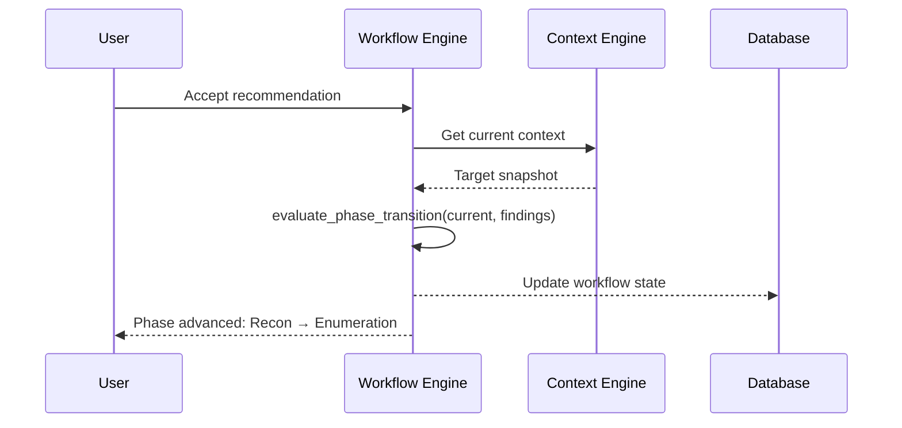
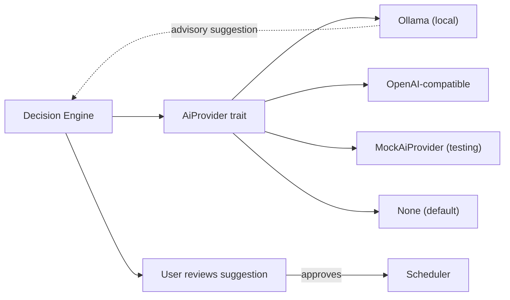

# Architecture

This document describes the internal architecture of the Zephyx platform.

---

## Overview

Zephyx is a **Cargo workspace** with three crates:

| Crate | Role |
|---|---|
| `zpx-core` | All business logic — the platform library |
| `zpx-cli` | The `zpx` CLI binary (thin consumer of `zpx-core`) |
| `zpx-tui` | The Ratatui TUI dashboard (thin consumer of `zpx-core`) |

All significant logic lives in `zpx-core`. The CLI and TUI are intentionally thin, serving as user-facing shells.

---

## Platform Architecture



---

## Module Map

```
zpx-core/src/
├── ai/             # AI provider abstractions (Ollama, OpenAI, Mock)
├── api/            # Internal REST API server
├── artifact/       # Artifact store (tool outputs + checksums)
├── capability/     # Capability registry (tool → capability mapping)
├── config.rs       # Execution profiles and configuration
├── context.rs      # Context engine (aggregated target snapshot)
├── db.rs           # SQLite persistence (all CRUD operations)
├── decision.rs     # Deterministic decision engine
├── dependency/     # Tool dependency resolution
├── engine/         # Analysis and scoring engines
├── events.rs       # Event bus (publish/subscribe)
├── evidence/       # Evidence store (SHA-256 integrity)
├── execution/      # Task execution lifecycle
├── explainability.rs # Recommendation explainability
├── export/         # Multi-format export engine
├── graph/          # Knowledge graph (nodes and edges)
├── heuristics.rs   # Pattern-based heuristic scoring
├── installer/      # Platform-aware tool installer
├── knowledge/      # Knowledge pack management
├── learning.rs     # Outcome learning and memory
├── marketplace/    # Plugin marketplace registry
├── memory.rs       # Long-term memory system
├── models.rs       # ALL shared data models (Finding, Phase, Task, etc.)
├── package/        # Tool pack bundling
├── pipeline/       # Automation pipeline engine
├── planner.rs      # Workflow planning
├── platform/       # OS detection and platform adapter
├── plugin/         # Plugin system (manifest, loader, parser)
├── recommendation/ # Recommendation queue
├── report/         # Report generation
├── replay/         # Session replay / timeline
├── resource/       # CPU/memory resource management
├── rules/          # Rule pack management
├── scheduler/      # Async task scheduler
├── sdk/            # Plugin SDK
├── service/        # High-level service facades
├── session/        # Session lifecycle management
├── snapshot/       # Workspace snapshot management
├── stats/          # Workflow statistics
├── tool_manager/   # Tool catalog and binary resolution
├── workflow/       # Workflow state machine + templates
└── workspace/      # Central workspace management
```

---

## Data Flow

### Finding Flow



### Workflow Transition



---

## Core Data Models

All shared types are defined in `zpx-core/src/models.rs`:

| Type | Description |
|---|---|
| `Phase` | Enum of 9 workflow phases |
| `Finding` | A discovered artifact (port, credential, flag, etc.) |
| `FindingKind` | Typed variant of what was found |
| `Recommendation` | Decision engine output with command, reasoning, priority |
| `Task` | A scheduled tool execution with full lifecycle state |
| `AttackNode` / `AttackEdge` | Knowledge graph primitives |
| `Evidence` | SHA-256 verified evidence tied to a Finding |
| `Snapshot` | Workspace state snapshot |
| `WorkflowPhaseInfo` | Phase metadata (prerequisites, plugins, progress) |
| `RulePackInfo` | Rule pack descriptor |
| `ReplayRecord` | Execution timeline entry |

---

## Event Bus

The event bus (`events.rs`) enables loose coupling between subsystems:

```rust
pub enum ZephyxEvent {
    FindingDiscovered(Finding),
    PhaseTransitioned { from: Phase, to: Phase },
    TaskStateChanged { id: String, state: TaskState },
    RecommendationGenerated(Recommendation),
    SnapshotCreated(Snapshot),
}
```

Subscribers (Workflow Engine, Scheduler, UI) react to events without direct coupling.

---

## Persistence

All persistent state lives in an SQLite database at `~/.zephyx/database/zephyx.db`:

- Findings, tasks, journal entries, snapshots, log entries
- Accessed exclusively through `DatabaseManager` in `db.rs`
- No direct SQL in business logic modules — all queries are encapsulated

---

## AI Integration



The `AiProvider` trait is the only interface AI touches. It returns suggestions — it has no access to the Scheduler, filesystem, or database.
