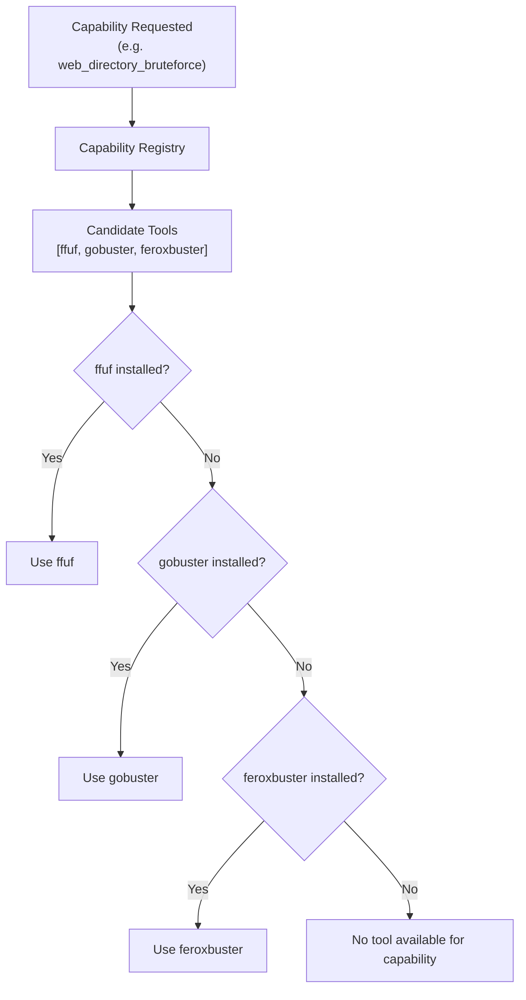

# Capability Registry

The Capability Registry is Zephyx's abstraction layer between "what you need to do" and "which tool does it."

---

## Why Capabilities?

Instead of hardcoding `nmap` as your port scanner, you request the `port_scanning` capability. The registry finds the best available tool that provides that capability.

**Benefits:**
- Your workflow works even if your preferred tool isn't installed
- Fallback chains are automatic
- New tools can be added without changing workflow logic

---

## How Resolution Works



---

## Built-in Capability Map

| Capability | Candidate Tools (priority order) |
|---|---|
| `port_scanning` | rustscan, nmap |
| `service_detection` | nmap |
| `web_directory_bruteforce` | ffuf, gobuster, feroxbuster |
| `smb_enumeration` | enum4linux, netexec, smbmap |
| `technology_detection` | whatweb, nikto |
| `vulnerability_scanning` | searchsploit, nikto, nmap |
| `privilege_escalation` | linpeas, winpeas, lse |
| `sql_injection` | sqlmap |
| `credential_bruteforce` | hydra |
| `ad_enumeration` | netexec, bloodhound, kerbrute |
| `process_monitoring` | pspy |
| `credential_dumping` | mimikatz, secretsdump |

---

## Commands

```bash
# List all capability mappings
zpx capability list

# Resolve the best tool for a specific capability
zpx capability resolve web_directory_bruteforce
```

**Example output:**
```
Capability 'web_directory_bruteforce' resolved to candidate 'ffuf' at path: ~/.zephyx/bin/ffuf
```

---

## Custom Capabilities

Plugins can register custom capabilities in their manifest:

```toml
[plugin]
capabilities = ["custom_api_fuzzing", "graphql_enumeration"]
```

Once registered, the Decision Engine can use these capabilities in its recommendations.

---

## Capability in Rules

Rule packs reference capabilities, not specific tools:

```toml
[[rules]]
trigger.finding_kind = "Port"
trigger.service = "http"
action.capability = "web_directory_bruteforce"
# The registry resolves which tool to use at runtime
```

This means rule packs work correctly regardless of which tools you have installed.
