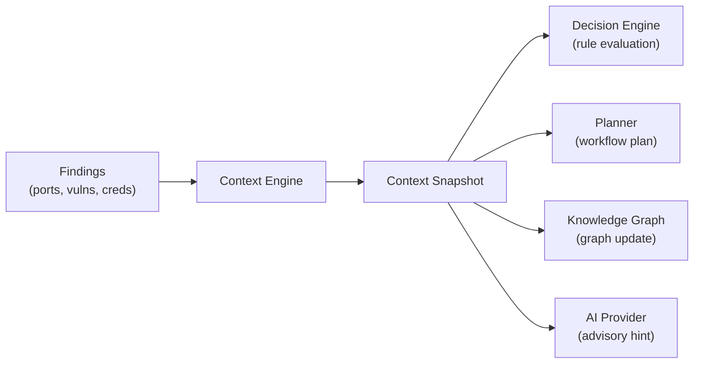

# Context Engine

The Context Engine maintains an aggregated snapshot of everything Zephyx knows about a target. It is the primary input to the Decision Engine and Planner.

---

## What Is a Context Snapshot?

A context snapshot aggregates:
- Target IP and hostname
- All open ports and running services
- All discovered credentials
- Current workflow phase
- Phase history
- Technology stack (CMS, frameworks, server versions)
- Vulnerability count by severity

---

## Data Structure

```rust
pub struct TargetContextSnapshot {
    pub target_ip: String,
    pub target_name: String,
    pub open_ports: Vec<u16>,
    pub services: Vec<String>,
    pub credentials: Vec<String>,
    pub phase: Phase,
    pub vulnerability_count: usize,
    pub flags_captured: usize,
}
```

---

## How It's Used



Every time a new finding is stored, the Context Engine updates the snapshot. This keeps the Decision Engine working from the latest state.

---

## Commands

```bash
zpx context show
```

**Output:**
```
Zephyx Target Context Engine:
  Target:     HTB-Lame (10.10.10.3)
  Open Ports: [21, 22, 80, 139, 445, 3632]
  Services:   [vsftpd 2.3.4, OpenSSH 4.7p1, Apache 2.4.7, distcc]
  Phase:      Vulnerability Discovery
  Vulns:      2 (1 Critical, 1 High)
  Flags:      0
```

---

## Integration

The context snapshot is passed to:
- The **Decision Engine** for rule evaluation
- The **Workflow Planner** for step generation
- The **Knowledge Graph** for node/edge construction
- The **AI Provider** as context for advisory suggestions
