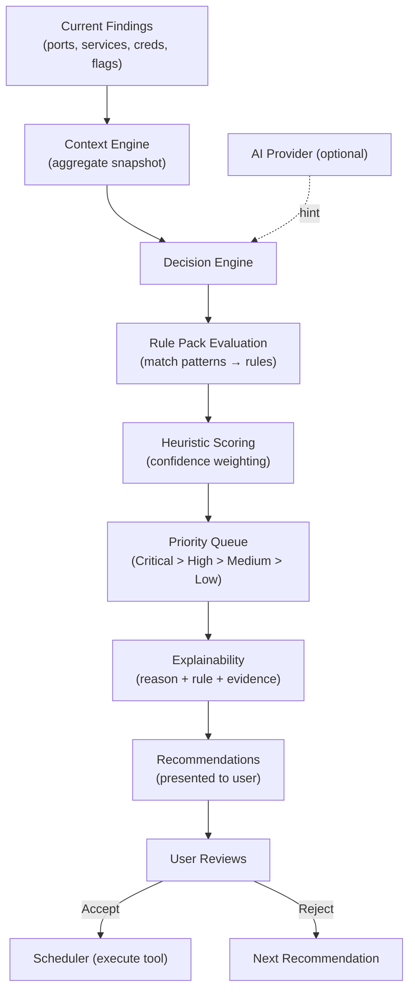

# Decision Engine

The Decision Engine is the intelligence core of Zephyx. It analyzes findings, applies deterministic rules, and generates prioritized, reasoned recommendations — all without requiring any AI or network connection.

---

## Philosophy

> Every recommendation Zephyx makes has a clear, auditable reason. No black boxes.

The Decision Engine is **fully deterministic**:
- Recommendations come from TOML-defined rule packs
- Every recommendation includes the triggering rule, confidence score, and evidence chain
- AI is optional and advisory-only — it can suggest but never decide

---

## How It Works



---

## Rule Packs

Rules are defined in TOML format and stored in `~/.zephyx/rules/`.

### Example Rule

```toml
[[rules]]
id = "web-dir-bruteforce"
name = "Web Directory Enumeration"
description = "HTTP port is open — recommend directory bruteforce"
priority = "High"
confidence = 0.90

[rules.trigger]
finding_kind = "Port"
service = "http"
port_range = [80, 443, 8080, 8443]

[rules.action]
tool = "ffuf"
capability = "web_directory_bruteforce"
command_template = "ffuf -w {wordlist} -u http://{target}/FUZZ -mc 200,301,302"
```

---

## Priority Levels

| Priority | Description | Examples |
|---|---|---|
| **Critical** | Immediate exploitation path | Default credentials, unauthenticated RCE |
| **High** | Strong attack vector | Web dir found, SMB unauthenticated |
| **Medium** | Useful but not urgent | Technology version identified |
| **Low** | Informational | Open port with unknown service |

---

## Recommendation Structure

Each recommendation includes:

```
Title:          Run Web Directory Enumeration
Tool:           ffuf
Command:        ffuf -w /usr/share/wordlists/dirb/common.txt -u http://10.10.10.3/FUZZ
Priority:       HIGH
Confidence:     92%
Status:         PENDING
Reason:
  - Finding: Port 80 (http) — Apache/2.4.7
  - Rule: RulePackMatch::WebDirectoryBruteforce
  - Evidence: HTTP 200 response to GET /
Target Phase:   Enumeration
```

---

## Commands

```bash
# Inspect current decision engine recommendations
zpx decision inspect
```

---

## Explainability Engine

Every recommendation carries a full explanation:

```rust
pub struct ExplainabilityReport {
    pub decision_title: String,
    pub primary_reason: String,
    pub confidence_score: f32,
    pub supporting_evidence: Vec<String>,
    pub deterministic_rule: String,
}
```

This ensures that:
- Users understand why a tool is being recommended
- The recommendation can be audited or challenged
- Reports can include the reasoning chain

---

## Integration with AI

When an AI provider is configured:

1. The Decision Engine runs its full deterministic evaluation first
2. The AI provider receives the context snapshot and top recommendations
3. The AI **may suggest** an alternative recommendation or ordering
4. The AI suggestion is shown alongside the deterministic recommendation, clearly labeled
5. The user decides which to act on
6. The AI's suggestion is logged but never automatically executed

AI suggestions are always advisory. The Scheduler only accepts tasks from user-approved recommendations.

---

## Managing Rules

```bash
zpx rules list                  # List all rule packs
zpx rules enable ctf-recon      # Enable a rule pack
zpx rules disable web-noisy     # Disable a rule pack
zpx rules info ctf-recon        # View rule pack details
```
