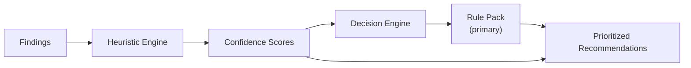

# Heuristics

Zephyx uses a heuristic engine to score and rank findings even when deterministic rules don't apply.

---

## What Are Heuristics?

Heuristics are pattern-based scoring functions that assign confidence scores to findings based on known security patterns. They supplement rule packs to handle cases that rules don't explicitly cover.

---

## Heuristic Scoring

Each heuristic returns a confidence score between 0.0 and 1.0:

```rust
pub struct HeuristicScore {
    pub heuristic_id: String,
    pub description: String,
    pub confidence: f32,   // 0.0 (no confidence) to 1.0 (certain)
    pub tags: Vec<String>,
}
```

---

## Built-in Heuristics

### Port-Based Heuristics

| Port(s) | Heuristic | Confidence |
|---|---|---|
| 80, 443 | `web_server_present` | 0.95 |
| 21 | `ftp_server_present` | 0.90 |
| 22 | `ssh_server_present` | 0.90 |
| 139, 445 | `smb_server_present` | 0.90 |
| 3306 | `mysql_exposed` | 0.85 |
| 5432 | `postgres_exposed` | 0.85 |
| 27017 | `mongodb_exposed` | 0.80 |
| 3389 | `rdp_exposed` | 0.88 |
| 3632 | `distcc_service` | 0.92 |

### Service-Based Heuristics

| Service Pattern | Heuristic | Confidence |
|---|---|---|
| vsftpd 2.3.4 | `vsftpd_backdoor_candidate` | 0.95 |
| Apache + PHP | `php_injection_surface` | 0.80 |
| WordPress | `wordpress_attack_surface` | 0.88 |
| SMB anonymous | `smb_anonymous_read` | 0.90 |

### Phase-Based Heuristics

Heuristics also apply based on current phase:
- In **Recon**: boost port scan confidence
- In **Enumeration**: boost web endpoint confidence
- In **Exploitation**: boost credential confidence

---

## How Heuristics Feed the Decision Engine



Heuristics produce confidence-weighted signals. The Decision Engine combines these with rule pack outputs to produce final recommendations.

---

## Custom Heuristics

Custom heuristics can be added through rule packs in `~/.zephyx/rules/`:

```toml
[[heuristics]]
id = "custom-cms-detection"
description = "Joomla CMS detected via /administrator/ endpoint"
trigger.http_endpoint.path = "/administrator/"
trigger.http_endpoint.status = 200
confidence = 0.85
tags = ["cms", "joomla", "web"]
```
