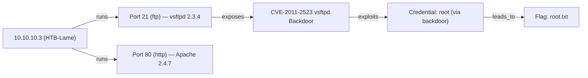

# Knowledge Graph

The Knowledge Graph is Zephyx's live attack map. It represents the relationships between discovered hosts, services, credentials, vulnerabilities, and flags as a queryable graph structure.

---

## Concept

Traditional security notes are flat lists. The Knowledge Graph models the **relationships** between findings:

- A **host** runs **services**
- A **service** has **vulnerabilities**
- A **vulnerability** is **exploited by** a credential
- A **credential** grants **access to** the system
- Access leads to **flags**

This relational structure helps the Decision Engine and Planner reason about the attack path.

---

## Graph Structure

### Node Types

| Node Type | Description | Example |
|---|---|---|
| `Host` | Target machine | `10.10.10.3 (HTB-Lame)` |
| `Service` | Running service | `Apache 2.4.7 on port 80` |
| `Credential` | Username/password or hash | `msfadmin:msfadmin` |
| `Vulnerability` | Known CVE or misconfiguration | `CVE-2004-2687 distcc` |
| `Flag` | Captured CTF flag | `user.txt: abc123...` |
| `Loot` | Collected file or data | `/etc/shadow` |

### Edge Types (Relationships)

| Relationship | Description |
|---|---|
| `runs` | Host → Service |
| `exposes` | Service → Vulnerability |
| `exploits` | Attack → Vulnerability |
| `authenticates_with` | Access → Credential |
| `leads_to` | Vulnerability → Flag |
| `contains` | Service → Loot |

---

## Viewing the Graph

```bash
zpx graph show
```

**Output (Mermaid format):**


---

## Graph Data Model

```rust
pub struct AttackNode {
    pub id: String,
    pub node_type: String,  // Host, Service, Credential, Vulnerability, Flag
    pub label: String,
    pub metadata_json: String,
}

pub struct AttackEdge {
    pub id: String,
    pub source_id: String,
    pub target_id: String,
    pub relationship: String, // runs, exposes, exploits, authenticates_with
}
```

---

## Graph → Mermaid Export

The graph can be exported as a Mermaid diagram for embedding in reports:

```bash
zpx graph show
```

The Mermaid output can be embedded directly in Markdown files for GitHub rendering.

---

## How the Graph Is Built

The graph is updated automatically as findings are discovered:

1. A `Port` finding creates a `Service` node and a `Host→Service` edge
2. A `Vulnerability` finding creates a `Vulnerability` node and a `Service→Vulnerability` edge
3. A `Credential` finding creates a `Credential` node
4. A `Flag` finding creates a `Flag` node
5. The planner traverses the graph to determine the shortest attack path
