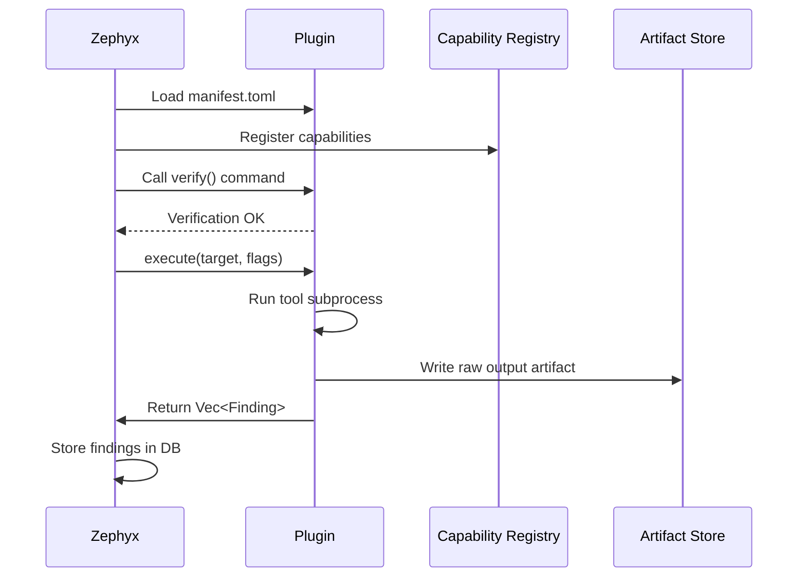

# Plugin SDK

The Plugin SDK provides the building blocks for creating Zephyx-compatible tool plugins in Rust.

---

## SDK Location

The SDK is defined in `zpx-core/src/sdk/`.

---

## Core SDK Types

### `FindingBuilder`

Fluent API for constructing `Finding` objects:

```rust
use zpx_core::sdk::FindingBuilder;
use zpx_core::models::FindingKind;

let finding = FindingBuilder::new("10.10.10.3", "my-scanner")
    .kind(FindingKind::Port {
        port: 80,
        protocol: "tcp".to_string(),
        service: "http".to_string(),
        version: Some("Apache/2.4.7".to_string()),
    })
    .confidence(0.95)
    .build();
```

### `ArtifactWriter`

Write raw tool output to the artifact store:

```rust
use zpx_core::sdk::ArtifactWriter;

let artifact_id = ArtifactWriter::write(
    session_id,
    "my-scanner",
    "application/json",
    raw_json_bytes,
)?;
```

### `CapabilityResolver`

Query the capability registry from within your plugin:

```rust
use zpx_core::sdk::CapabilityResolver;

if let Ok((tool, path)) = CapabilityResolver::resolve("port_scanning") {
    println!("Using {} at {}", tool, path);
}
```

---

## Plugin Lifecycle



---

## Minimal Plugin Implementation

```rust
use zpx_core::models::{Finding, FindingKind};
use anyhow::Result;

pub struct MyScanner;

impl MyScanner {
    pub fn run(target: &str) -> Result<Vec<Finding>> {
        // Execute your tool
        let output = std::process::Command::new("my-scanner")
            .arg("--target").arg(target)
            .arg("--format").arg("json")
            .output()?;

        // Parse output into findings
        let raw = String::from_utf8_lossy(&output.stdout);
        parse_output(&raw, target)
    }
}

fn parse_output(raw: &str, target: &str) -> Result<Vec<Finding>> {
    let mut findings = Vec::new();
    // ... parsing logic
    Ok(findings)
}
```

---

## Registering in Manifest

```toml
[plugin]
id = "my-scanner"
version = "1.0.0"
capabilities = ["port_scanning"]
verification_command = "my-scanner --version"
```

---

## Testing

```bash
# After installing your plugin
zpx plugin doctor
zpx capability resolve port_scanning
zpx scan --ip 127.0.0.1
```

See [plugin-development.md](plugin-development.md) for the full development guide.
