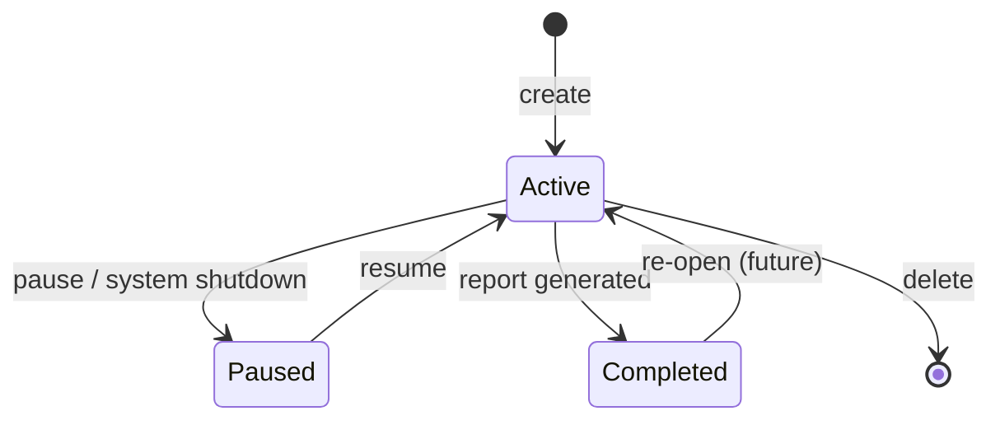

# Sessions

Sessions are Zephyx's top-level unit of work. Each session represents a single assessment engagement against a specific target.

---

## What Is a Session?

A session encapsulates:
- The target IP, name, and metadata
- All findings discovered during the assessment
- All artifacts (tool outputs) produced
- All tasks executed and their results
- The workflow phase history
- The final reports

Sessions are stored in `~/.zephyx/sessions/` and can be resumed across reboots.

---

## Session Lifecycle



---

## Session Directory Structure

```
~/.zephyx/sessions/session-{id}/
├── metadata.json     # Session metadata (name, target, timestamps, status)
├── artifacts/        # Raw tool output files (XML, JSON, text)
├── evidence/         # SHA-256 verified evidence files
├── reports/          # Generated report files
├── logs/             # Per-task execution logs
└── exports/          # Packaged export bundles (ZIP archives)
```

---

## `metadata.json` Format

```json
{
  "id": "session-a1b2c3d4",
  "name": "HTB-Lame",
  "target_ip": "10.10.10.3",
  "created_at": "2026-07-25T17:00:00Z",
  "updated_at": "2026-07-25T18:30:00Z",
  "status": "Active",
  "active_profile": "default"
}
```

---

## Commands

### Create a Session

```bash
zpx session create --name "HTB-Lame" --target 10.10.10.3
```

Creates a new session with a unique ID, initializes the directory structure, and writes `metadata.json`.

### List Sessions

```bash
zpx session list
```

**Output:**
```
Zephyx Recorded Sessions (3)
  • session-a1b2c3d4  [Active   ] Target: 10.10.10.3    Created: 2026-07-25 17:00
  • session-b5c6d7e8  [Completed] Target: 10.10.10.5    Created: 2026-07-24 09:30
  • session-c9d0e1f2  [Paused   ] Target: 10.10.10.10   Created: 2026-07-23 14:15
```

Sessions are sorted newest-first.

### Resume a Session

```bash
zpx session resume session-a1b2c3d4
```

Updates the session status to "Active" and records the resume timestamp.

---

## Session Status Values

| Status | Description |
|---|---|
| `Active` | Currently in progress |
| `Paused` | Work stopped, can be resumed |
| `Completed` | Report generated, assessment done |

---

## Snapshots

You can snapshot a session's current state for backup or restoration:

```bash
zpx snapshot create
zpx snapshot list
zpx snapshot restore snap-id
```

See [artifact-store.md](artifact-store.md) for how artifacts are managed within sessions.
