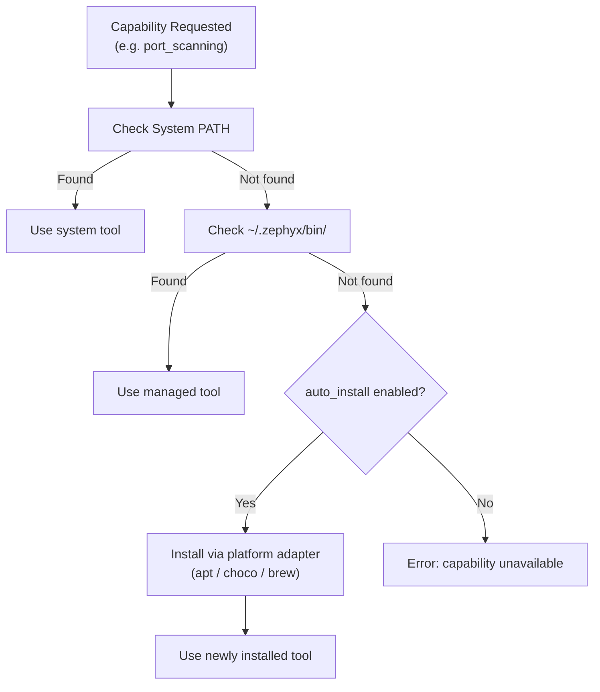

# Tool Manager

The Tool Manager is Zephyx's central catalog for managing security tool binaries. It tracks installation status, resolves the best available tool for a given capability, and handles automatic installation.

---

## Concepts

### System Tools
Tools already installed on your operating system, available via `$PATH` (e.g., `nmap` installed via `apt`).

### Managed Tools
Tools installed and managed by Zephyx itself, stored in `~/.zephyx/bin/`. Zephyx handles their installation, updates, and version tracking.

### Capabilities vs Tools
Instead of requesting a specific tool, Zephyx uses **capabilities**:
- Request: `web_directory_bruteforce`
- Resolution: first available of `ffuf`, `gobuster`, `feroxbuster`

This means your workflow still works even if your preferred tool isn't installed.

---

## Resolution Order



---

## Commands

```bash
# List all tools with installation status and path
zpx tool list

# Verify a specific tool is accessible
zpx tool verify nmap

# Install a tool (to ~/.zephyx/bin/ or via platform package manager)
zpx tool install ffuf

# Update an installed tool
zpx tool update gobuster
```

---

## Tool Catalog

| Tool | Capability | Category |
|---|---|---|
| `nmap` | port_scanning, service_detection | Recon |
| `rustscan` | port_scanning | Recon |
| `ffuf` | web_directory_bruteforce | Enumeration |
| `gobuster` | web_directory_bruteforce | Enumeration |
| `feroxbuster` | web_directory_bruteforce | Enumeration |
| `enum4linux` | smb_enumeration | Enumeration |
| `netexec` | smb_enumeration, ad_enumeration | Enumeration |
| `smbmap` | smb_enumeration | Enumeration |
| `whatweb` | technology_detection | Enumeration |
| `nikto` | vulnerability_scanning, technology_detection | Scanning |
| `searchsploit` | vulnerability_scanning | Exploitation |
| `sqlmap` | sql_injection | Exploitation |
| `hydra` | credential_bruteforce | Exploitation |
| `linpeas` | privilege_escalation | Post-exploitation |
| `winpeas` | privilege_escalation | Post-exploitation |
| `lse` | privilege_escalation | Post-exploitation |
| `pspy` | process_monitoring | Post-exploitation |
| `mimikatz` | credential_dumping | Post-exploitation |

---

## Tool Packs

Install groups of related tools at once:

```bash
zpx pack install recon       # nmap, rustscan, httpx, whatweb
zpx pack install web         # gobuster, ffuf, feroxbuster, sqlmap
zpx pack install ad          # netexec, bloodhound, crackmapexec, kerbrute
zpx pack install privesc     # linpeas, winpeas, privesccheck, pspy
```

---

## Example Output

```bash
$ zpx tool list

Zephyx Tool Manager Catalog (12)
  • nmap           [Installed    ] /usr/bin/nmap
  • rustscan       [Installed    ] /usr/local/bin/rustscan
  • ffuf           [Installed    ] ~/.zephyx/bin/ffuf
  • gobuster       [NOT INSTALLED] NOT INSTALLED
  • feroxbuster    [Installed    ] ~/.zephyx/bin/feroxbuster
  • enum4linux     [Installed    ] /usr/bin/enum4linux
  • whatweb        [Installed    ] /usr/bin/whatweb
  • nikto          [Installed    ] /usr/bin/nikto
  • searchsploit   [Installed    ] /usr/bin/searchsploit
  • sqlmap         [Installed    ] /usr/bin/sqlmap
  • linpeas        [NOT INSTALLED] NOT INSTALLED
  • winpeas        [NOT INSTALLED] NOT INSTALLED
```
