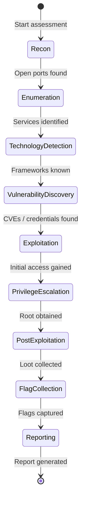

# Workflow Engine

The Workflow Engine is the core of Zephyx's methodology system. It provides a structured, phase-based approach to security assessments.

---

## Overview

The Workflow Engine implements a **finite state machine** over 9 assessment phases. It tracks the current state of an engagement, validates phase transitions, and integrates with the Decision Engine to determine when to advance.

---

## The 9 Phases



| Phase | Description | Typical Tools |
|---|---|---|
| **Recon** | Network discovery, ping sweep, port scan | nmap, rustscan |
| **Enumeration** | Service banners, web dirs, SMB shares | ffuf, gobuster, enum4linux |
| **Technology Detection** | CMS, framework, server version | whatweb, nikto, wappalyzer |
| **Vulnerability Discovery** | CVE lookup, misconfiguration check | searchsploit, nikto, nmap NSE |
| **Exploitation** | Credential attack, payload delivery | hydra, sqlmap, msfconsole |
| **Privilege Escalation** | SUID, sudo, token abuse | linpeas, winpeas, lse |
| **Post Exploitation** | Hash dump, key extraction, pivoting | mimikatz, secretsdump |
| **Flag Collection** | Locate and capture flags | flag-hunter, manual |
| **Reporting** | Compile writeup | zpx-report |

---

## Phase Info

Each phase has rich metadata accessible via the engine:

```bash
zpx workflow status
```

Output:
```
Active Phase: Service Enumeration (30%)
Description:  Service banner grabbing, web directory fuzzing, SMB share enumeration
Prerequisites: [Reconnaissance]
Supported Plugins: [nmap, ffuf, gobuster, enum4linux]
Expected Findings: [HTTP Endpoints, SMB Shares, SSH Banners]
Next Phases: [Technology Detection]
Estimated Duration: ~7 minutes
```

---

## Automatic Phase Transition

The engine evaluates findings to automatically determine when to advance phases:

| Current Phase | Transition Trigger |
|---|---|
| Recon | Open ports discovered |
| Enumeration | Web endpoints found |
| Technology Detection | (automatic) |
| Vulnerability Discovery | Vulnerabilities or credentials found |
| Exploitation | Credentials obtained |
| Privilege Escalation | Root/administrator credential or flag found |
| Flag Collection | Flags captured |

---

## Workflow Templates

Built-in templates for common engagement types:

```bash
zpx workflow list
```

| Template ID | Name | Target OS | Initial Phase |
|---|---|---|---|
| `htb-linux` | Hack The Box Linux | Linux | Recon |
| `htb-windows` | Hack The Box Windows | Windows | Recon |
| `thm-web` | TryHackMe Web | Any | Enumeration |
| `portswigger` | PortSwigger Academy | Web | Enumeration |
| `active-directory` | Active Directory Assessment | Windows | Enumeration |
| `linux-privesc` | Linux Privilege Escalation | Linux | PrivilegeEscalation |
| `windows-privesc` | Windows Privilege Escalation | Windows | PrivilegeEscalation |
| `web-assessment` | Comprehensive Web Audit | Web | Recon |
| `api-assessment` | REST/GraphQL API Assessment | API | Enumeration |

### Start a Template

```bash
zpx workflow start htb-linux
```

---

## Commands

```bash
zpx workflow list           # List all available templates
zpx workflow start <id>     # Start a workflow template
zpx workflow status         # Show current phase info and progress
zpx workflow pause          # Pause the active workflow
zpx workflow resume         # Resume a paused workflow
zpx workflow reset          # Reset to initial phase (lose progress)
```

---

## Rollback

If you need to go back to a previous phase:

```bash
# Rollback is done through the engine (future CLI command)
# The WorkflowEngine::rollback_phase() method handles this
```

Phase rollback sequence: `Reporting → FlagCollection → PostExploitation → PrivilegeEscalation → Exploitation → VulnerabilityDiscovery → TechnologyDetection → Enumeration → Recon`

---

## Progress Calculation

Progress is calculated as a combination of:
- **Base progress** from the current phase (15%–100%)
- **Bonus progress** from discovered findings (up to +10%)

```
progress = phase_base_percentage + min(findings.len() * 1.5, 10.0)
```
